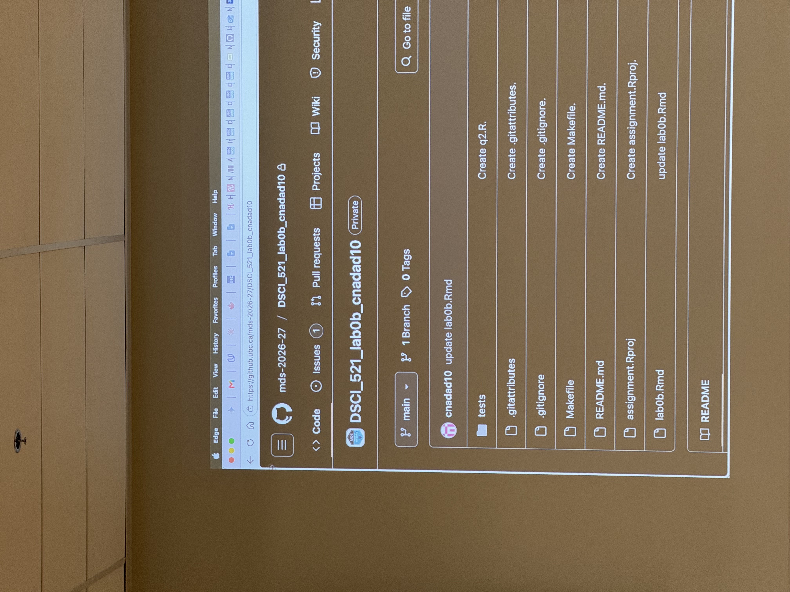

{width=250px}

MDS 2026 Cohort 11 began classes on Monday, August 31st 2026! Term 1 begins with 4 courses:
1. DSCI 511 Programming for Data Science - Programming in Python
2. DSCI 521 Computing Platforms for Data Science - Git, GitHub, and other Programming Tools
3. DSCI 523 Programming for Data Manipulation - Programming in R
4. DSCI 551 Descriptive Statistics and Probability for Data Science

Keeping up so far has been manageable, but they were not kidding about the speed haha.
Creating a sustainable routine to balance between the program's workload and taking breaks will prove to be very important.
Super grateful to be part of this program along with so many talented people - first couple of weeks done, just 9 more months to go!